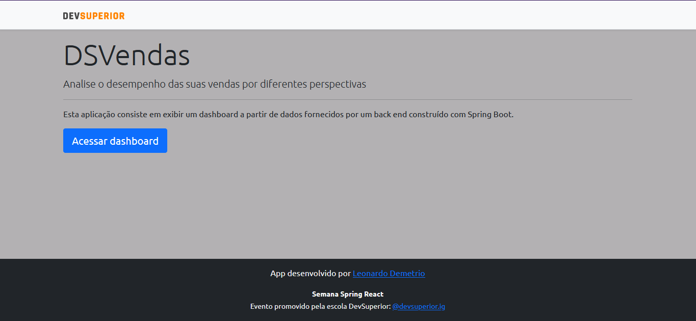
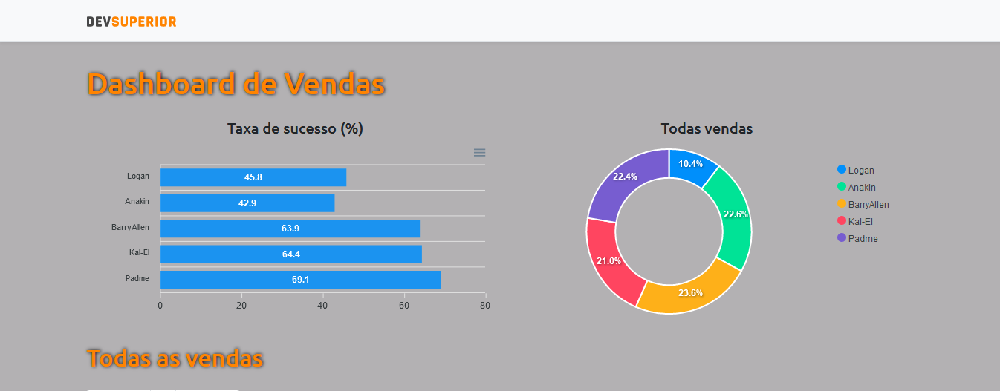
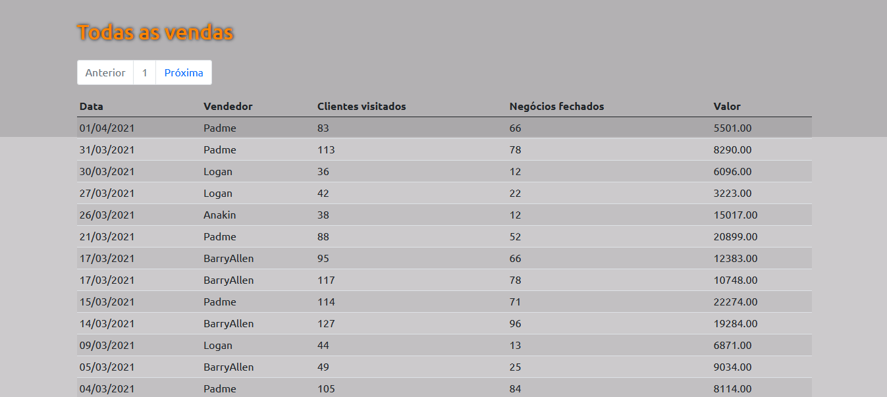

## Projeto Semana Spring React 3 

#### Desenvolvimento de uma aplicação de dashboard de vendas com React e Spring boot:

    Tecnologias utilizadas:
        - Java
        - Spring boot 
        - React.JS
        - Chart.JS

Rodando a aplicação: 

 - Back-end: 

    * Para rodar o back-end da aplicação é necessário ter Java 11+ e o Maven instalado no computador. 
    * Para rodar a aplicação, basta abrir ela no STS ou Intellij, baixar as dependências e rodar diretamente a aplicação pela IDE. Não é necessário nenhuma configuração prévia. 

 - Front-end:
    * Para rodar a aplicação no front-end, é necessário ter o Node V 16.13+. 
    
    Comandos de instalação: 
    
        Na pasta do projeto, rode os comandos:

        - npm i
        - npm start

    É necessário o back-end estar rodandoo para que o front-end funcione. 

